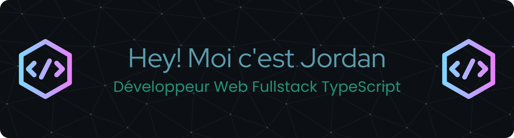

  

  Passionné par la création, la résolution de problèmes et l’apprentissage continu.

  
  
  

---

### 🚀 À propos de moi

Après plus de **8 ans dans le monde de l’assurance**, j’ai choisi de suivre ma véritable vocation : **créer, résoudre et construire des produits web**.  
Aujourd’hui, je suis **développeur fullstack TypeScript**, spécialisé sur **React** et **Next.js**, avec une vraie appétence pour le **front moderne**, les **API structurées** et les **projets collaboratifs**.

💡 Ce que j’aime dans le dev :
- Transformer une idée en produit concret et utile  
- Travailler en équipe avec une logique **Agile / SCRUM**  
- Découvrir, expérimenter et apprendre de nouvelles technos  

---

### 🧠 Stack technique

  

**Langages & Frameworks :** TypeScript · JavaScript · React · Next.js · Node.js · Express  
**Bases de données :** PostgreSQL · MySQL · SQLite · Prisma · Sequelize  
**Outils :** TailwindCSS · Figma · Git · GitHub · Méthodologie Agile (SCRUM)

---

### 🎓 Formations

- **Concepteur Développeur d'Applications :** Formation en alternance en cours auprès de la Wild Code School / Simplon.
- **Développeur Web et Web Mobile :** Formation suivie auprèe de la Wild Code School, titre professionel obtenu.
---

### 💼 Expériences professionnelles

#### 🌐 Alternance chez Kalysse - Concepteur Développeur d'Applications
Participation à la conception, au développement et au déploiement chez nos clients d'une solution de casiers connectés gérés par une borne ainsi qu'une application de supervision du parc.

> React & Express · TypeScript · Docker · Ubuntu

#### 🌐 Stage chez Num4 — Développeur Fullstack NextJS
Participation à la conception d’un **dashboard interne**, refonte du **front-end** et résolution de bugs du player audio.

> Collaboration en équipe Agile · intégrations API · versionning GitHub  
---

### 🎯 Projets marquants

#### 🎁 Giftizy — Projet solo
Application web entièrement conçue, développée et déployée seul.  
Giftizy permet un partage interactif de listes de souhaits entre amis ainsi que la création et la gestion d'évènements.

> **Stack :** Next.js 15 · TailwindCSS · PostgreSQL · Prisma · Zod · Better-Auth  
> **Fonctionnalités :** création de wishlists, partage entre amis, réservation des souhaits des amis, création et gestion d'évènements  
> **URL :** https://giftizy.fr/

#### 🎮 Wankul TCGP — Projet de fin de formation, compte plus de 400 utilisateurs
Application web inspirée du jeu Pokémon TCGP : **collection, échanges et défis entre amis**.

> **Stack :** Next.js 15 · CSS Modules · MySQL · API REST  
> **Fonctionnalités :** gestion des cartes, raretés, échanges, et système de défis  
> **URL :** https://wankulpocket.fr/

---

### 📈 Mes statistiques GitHub

  
  

---

### 📫 Me retrouver

  
  

---

<h3 align="center">💬 Toujours partant pour échanger autour du code, des projets ou d’un café virtuel ☕</h3>

  

